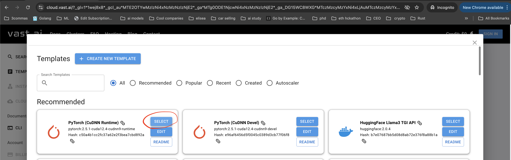
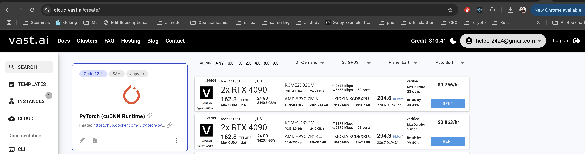
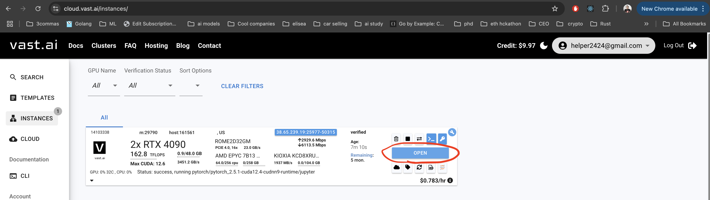
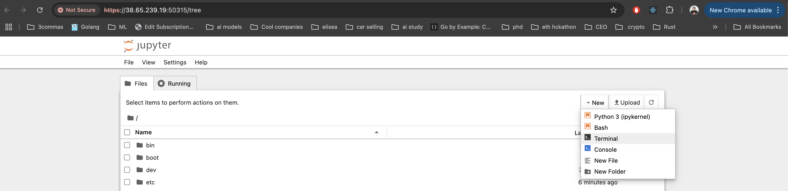
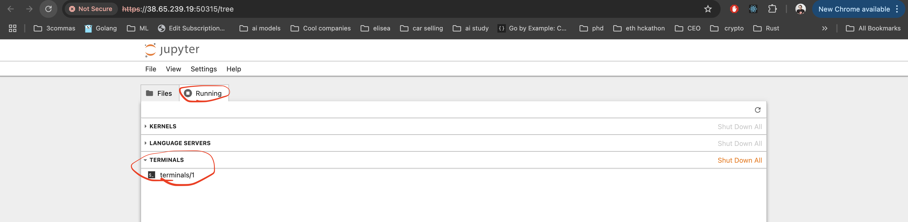

# Training Models for Lerobot Library on Vast AI

This guide will walk you through the steps to train models for the Lerobot library on Vast AI.

## Steps

1. **Rent the instance with GPU:**

  - Visit [Vast AI](https://vast.ai/).
  - Sign up for an account.
  - Chose the `PyTorch (cuDNN Runtime)` template.

  - Rent an instance that meets your requirements, I recommend using 2 RTX 4090 instance, it costa around $0.4-$0.8 per hour.
  
  - Once the instance is ready, open it.
  
  - Run a new terminal.
  
  - This terminal will be open and availble till u close the instance. You can fin it there
  

2. **Commit all the changes to your fork of Lerobot:**

  - Commit all the changes to your fork of Lerobot.
  - Push the changes to your fork of Lerobot.
  - Upload full dataset to Hugging Face, the lerobot script doesn't upload everything
```bash
huggingface-cli upload "${HF_USER}/${DS_NAME}" data/${HF_USER}/${DS_NAME} --repo-type dataset
```

HF_USER - your hugging face username, you should have it locally already
DS_NAME - dataset name, I have used koch_move_obj_static_cameras, you can you your own, for the vast ai isntance I setup it in the next step.

3. **Set up the environment:**

- Setup your repo name and dataset name
```bash
export DS_NAME=koch_test # Dataset name, I have used koch_move_obj_static_cameras
export REPO_NAME=koch_test # Repo name, I have used koch_move_obj_static_cameras
```

- Install deps
```bash

cd /
mkdir -p /app
cd app

git clone <link to your fork of Lerobot> # I used https://github.com/helper2424/lerobot.git
cd lerobot
git fetch origin <your branch> # I used helper2424_real_robo_env
git checkout to <your branch> # I used helper2424_real_robo_env
conda create -y -n lerobot python=3.10
conda init
```

- To apply all changes I ahve closed the termninal and opened a new one
```
cd /app/lerobot
conda activate lerobot
pip install -e .
pip install -e ".[dynamixel]"
conda install -c conda-forge ffmpeg
pip uninstall opencv-python
conda install -c conda-forge "opencv>=4.10.0"
pip install -U "huggingface_hub[cli]"
```

2. **Generate SSH keys and configure Hugging Face:**

```bash
ssh-keygen -t rsa -b 4096 -C "<your email>"

cat ~/.ssh/id_rsa.pub
# Add the key to https://huggingface.co/settings/keys
export HUGGINGFACE_TOKEN=<your hf token here> # Get the token from https://huggingface.co/settings/tokens
huggingface-cli login --token ${HUGGINGFACE_TOKEN} --add-to-git-credential
HF_USER=$(huggingface-cli whoami | head -n 1)
```

3. **Login in Wandb:**

```bash
wandb login
```

4. **Install Git LFS and clone the dataset:**

```bash
apt-get install git-lfs
git lfs install

mkdir -p data/${HF_USER}/
cd data/${HF_USER}/
git clone git@hf.co:datasets/${HF_USER}/${DS_NAME}
```

5. **Run the training script:**

```bash
cd ../../
DATA_DIR=data python lerobot/scripts/train.py \
  dataset_repo_id=${HF_USER}/${DS_NAME} \
  policy=act_koch_real \
  env=koch_real \
  hydra.run.dir=outputs/train/${REPO_NAME} \
  hydra.job.name=${REPO_NAME} \
  device=cuda \
  wandb.enable=true
```

- Upload trained model to HF
```bash
huggingface-cli upload ${HF_USER}/${REPO_NAME} \
  outputs/train/${REPO_NAME}/checkpoints/last/pretrained_model
```

6. **Clone the trained model repository to you local machine:**

- Return back to you local machine to the lerobot repository
- Go to `lerobot/outputs`
- Setup the env variables
```bash
export HF_USER=$(huggingface-cli whoami | head -n 1)
export REPO_NAME=koch_test
```
- Clone trained model locally
```bash
git clone https://huggingface.co/${HF_USER}/${REPO_NAME}
```

8. **Run the evaluation script:**

```bash
python lerobot/scripts/control_robot.py record \
  --robot-path lerobot/configs/robot/koch.yaml \
  --fps 30 \
  --root data \
  --repo-id ${HF_USER}/${REPO_NAME} \
  --tags tutorial eval \
  --warmup-time-s 5 \
  --episode-time-s 30 \
  --reset-time-s 30 \
  --num-episodes 1 \
  --policy-overrides "device=mps" \
  -p ${HF_USER}/${REPO_NAME} 
```
